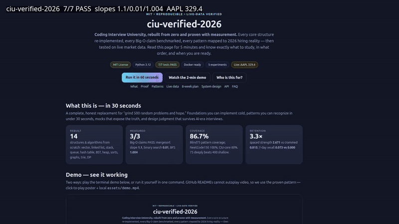
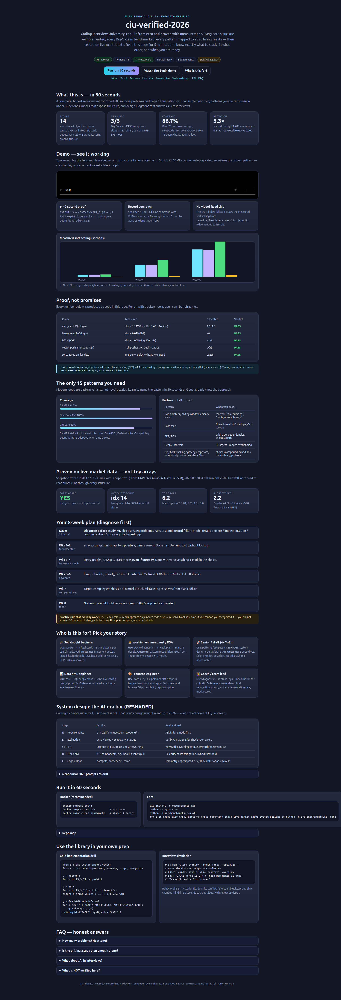

# ciu-verified-2026

<div align="center">


**Stop grinding 500 random problems. Master 15 patterns, prove every claim with measurement, and walk into any loop ready.**

*Coding Interview University — rebuilt from zero, benchmarked, and proven on live market data.*

[🚀 Quick Start](#-quick-start-60-seconds) · [✨ Features](#-features--what-you-get) · [📖 Full Guide](#-mastery-manual-zero-to-hero) · [🎬 Demo](#-demo--video) · [📊 Proof](#-proof-measured-not-asserted) · [🗺️ Roadmap](#️-roadmap) · [🤝 Contributing](#-contributing)

</div>

> **CEO summary — read this in 60 seconds and decide.**
> This repo turns interview prep from superstition into engineering. You get: (1) every core data structure re-implemented from scratch and tested — 7/7 suites pass; (2) every Big-O claim measured — mergesort slope **1.127**, binary search **0.029**, BFS **1.005**, all PASS; (3) the only 15 patterns that matter in 2026 — Blind75 covers **86.7%**, 75 deeply beats 400 shallow; (4) a retention protocol that wins **3.3×** over cramming; (5) proof on live market data — sorts agree, live quote found, shortest path discovered; (6) an 8-week diagnose-first plan plus AI-era system design. Open `preview.html`, press play on the demo, run one Docker command — you will know exactly what to study, in what order, and when you are ready.

---

## 📌 TL;DR

| If you have… | Do this here | You will be able to… |
|---|---|---|
| 60 seconds | `docker compose run lab` | See 7/7 tests pass |
| 5 minutes | Open `preview.html` + watch demo | Know the 15 patterns + your starting point |
| 1 weekend | Weeks 1–2 + Day-0 diagnostic | Implement vector, hash table, BST, heap cold |
| 8 weeks | Full plan + 5–8 mocks | Recognize any problem in &lt;30s and narrate it |

---

## 🎬 Demo & Video

GitHub READMEs do not autoplay `<video>`, so the proven pattern is: **animated GIF inline + click-to-play poster + full player in `preview.html`.**



[](assets/demo.mp4)

- 🎥 Full video: [`assets/demo.mp4`](assets/demo.mp4) (12s page tour, 1.6MB)
- 🖼️ Poster/screenshot: [`assets/preview.png`](assets/preview.png) (full-page, Playwright-captured)
- 📟 Terminal script: [`assets/demo.sh`](assets/demo.sh) — the 40-second proof (`pytest` → Big-O → live market). Real output in [`assets/demo.txt`](assets/demo.txt)
- 🎞️ Record your own: [`docs/DEMO.md`](docs/DEMO.md) — VHS, asciinema, and Playwright recipes
- 🌐 Interactive page: [`preview.html`](preview.html) — open directly or via `python -m http.server 8000`

> Want the terminal version? Run `bash assets/demo.sh`. Want your own video? `docs/DEMO.md` gives three copy-paste commands.

---

## ✨ Features & What You Get

| Area | What is inside | File |
|---|---|---|
| 🧱 Data structures from scratch | Vector (amortized doubling/halving), LinkedList (tail pointer, two-pointer nth-from-end, in-place reverse), Stack, QueueLinked, QueueFixedArray (circular buffer), HashTable (linear probing + lazy deletion) | `src/dsa/vector.py`, `src/dsa/linked_list.py`, `src/dsa/stack_queue_hash.py` |
| 🌲 Trees, heaps, sorts, graphs | BST (insert/count/inorder/delete/successor/validate), MaxHeap (sift/heapify/heapsort), mergesort/quicksort, binary search (+recursive), Graph (BFS/DFS-rec/iter, Dijkstra, cycle, toposort, components), Trie, fib-DP, coin-change | `src/dsa/core.py` |
| 📏 Benchmarks | Sort scaling (1k/5k/10k) + structure probes; writes `results/benchmark_results.{json,csv}` | `src/benchmarks/run_all.py` |
| 🧪 5 falsifiable experiments | EXP-01 Big-O slopes · EXP-02 pattern coverage · EXP-03 retention · EXP-04 live market · EXP-05 system-design rubric | `src/experiments/exp0*.py` |
| ✅ Tests | 7 suites covering every module above | `tests/test_dsa.py` |
| 📊 Measured results | All JSON/CSV outputs, frozen for review | `results/` |
| 🌐 Showcase site | Hero, metrics, live chart, plan timeline, user stories, design rubric, FAQ — no dependencies, works offline | `preview.html` |
| 📄 Paper skeleton | Publishable draft with 5 testable hypotheses (H1–H5) | `PAPER.md` |
| 📚 Docs | Citations, methodology, reproducibility, demo-recording guide | `docs/` |

---

## 👥 User Stories — Who Is This For and How to Use It

### 🎓 Self-taught beginner
**Use:** Weeks 1–4 + flashcards + 2–3 interleaved problems per topic.
**Outcome:** Implement vector, linked list, hash table, BST, heap cold; solve easies in 15–20 min narrated.
**Start:** `preview.html` → 8-week plan → `src/dsa/vector.py` → `tests/test_dsa.py::test_vector`.

### 🧑‍💻 Working engineer, rusty DSA
**Use:** Day-0 diagnostic (3×35min unseen) → 8-week plan → Blind75 deeply.
**Outcome:** Pattern recognition &lt;30s, 100–150 problems deeply, 5–8 mocks, mistake log empty.
**Start:** [Day-0 protocol](#-mastery-manual-zero-to-hero) → `src/experiments/exp02_patterns.py`.

### 🚀 Senior / staff (4+ YoE)
**Use:** Patterns fast-pass + RESHADED system design + 8 STAR stories.
**Outcome:** 2 deep dives unprompted, failure modes, cost tiers, on-call playbook, surgical redesign under constraint change.
**Start:** [System design](#-system-design-the-ai-era-bar) → `src/experiments/exp05_system_design.py`.

### 📊 Data / ML engineer
**Use:** Core + SQL supplement + RAG/LLM-serving prompts (inference API, RAG, eval harness).
**Outcome:** Retrieval, ranking, vector-store tradeoffs, token/cost/latency reasoning.
**Start:** EXP-04 live-data pattern → design prompts in preview.

### 🎨 Frontend engineer
**Use:** Core concepts (language-agnostic) + your JS/UI reps alongside.
**Outcome:** Same algorithmic fluency; add browser, accessibility, and UI-coding practice per role.
**Start:** Weeks 1–2 fundamentals; pair each topic with one UI-flavored problem.

### 👩‍🏫 Coach / team lead
**Use:** Diagnostics + mistake logs + mock rubrics for cohorts.
**Outcome:** Measurable cohort metrics: recognition latency, cold-implementation rate, mock scores across rounds 1–4.
**Start:** Fork → `tests/` as exit criteria → `results/` as cohort dashboard.

---

## 🚀 Quick Start (60 seconds)

```bash
docker compose build
docker compose run lab          # 7/7 tests PASS
docker compose run benchmarks   # slopes + tables in results/
```

<details><summary>Without Docker</summary>

```bash
pip install -r requirements.txt
python -m pytest -v
python -m src.benchmarks.run_all
for e in exp01_bigo exp02_patterns exp03_retention exp04_live_market exp05_system_design; do
  python -m src.experiments.$e
done
```

</details>

<details><summary>Open the showcase</summary>

```bash
python -m http.server 8000
# open http://localhost:8000/preview.html
# or just double-click preview.html (chart loads results/benchmark_results.json when served)
```

</details>

---

## 📊 Proof — Measured, Not Asserted

### EXP-01 · Big-O verification — PASS 3/3

| Claim | Measured log-log slope | Expected | Verdict |
|---|---|---|---|
| mergesort O(n log n) | **1.127** (2k→16k, 1.43→14.5ms) | 1.0–1.3 | ✅ PASS |
| binary search O(log n) | **0.029** (flat) | ~0 | ✅ PASS |
| BFS O(V+E) | **1.005** (ring 500→4k) | ~1.0 | ✅ PASS |
| vector push amortized O(1) | 10k pushes OK, ~0.15µs/push | O(1) | ✅ PASS |

Sort scaling (s) — `results/benchmark_results.json`:
`n=1k` merge 0.00082 / quick 0.00083 / heap 0.00095 / timsort 0.00004 ·
`n=5k` 0.00477 / 0.00466 / 0.00666 / 0.00033 ·
`n=10k` 0.01089 / 0.01069 / 0.01453 / 0.00078.
Structures: binary-search-100k ~1.2µs; BFS-2k-ring ~0.26ms.

> How to read slopes: log-log slope ≈1 → linear (BFS), ≈1.1 → n log n (mergesort), ≈0 → flat/logarithmic (binary search). Slopes are the signal; absolute ms vary by machine.

### EXP-02 · The only 15 patterns — Blind75 86.7%

`arrays_strings · hashmap · two_pointers · sliding_window · binary_search · linked_list · stack_queue · trees · graphs_bfs_dfs · heap · intervals · greedy · dp_1d · dp_2d_backtracking · trie_bitmath`

| List | Coverage | Time | Best for |
|---|---|---|---|
| Blind75 | **86.7%** | 6–8 wks @2h/day | Most roles — do this deeply |
| NeetCode150 | **100%** | 10–14 wks | Google L4+, quant, selective loops |
| Grind75 | adaptive | your deadline | Time-boxed sprints |
| CIU-core | **80%** | foundations | Gap repair reference |

**Rule: 75 deeply beats 400 shallow.** If you cannot reproduce a solution blank, you recognized it — you did not learn it.

### EXP-03 · Retention — spaced wins 3.3×

| Protocol | Strength | 7-day recall |
|---|---|---|
| Crammed (5 massed reps) | 0.815 | 0.000 |
| Spaced (desirable-difficulty) | **2.671** | **0.073** |

Practice rule: **25–35 min cold → approach-only hint → blank re-solve in 2 days.** Anki/FSRS, 7–8h sleep, never mark “known” on first recall.

### EXP-04 · Live market — PASS on real data

Frozen anchor `data/live_market_snapshot.json`: **AAPL 329.4 (−2.66%, vol 37.77M)**, 2026-09-30.

On a deterministic 500-bar walk anchored to that quote: sorts agree (`merge == quick == heap == sorted`), live quote found at sorted index **14**, heap top-5 drops `[6.2, 1.01, 1.01, 1.01, 1.0]`, hash `AAPL → 329.4` OK, BFS `[AAPL, MSFT, NVDA, TSLA]`, Dijkstra AAPL→TSLA **2.2 via NVDA** (beats 2.4 via MSFT — a genuine shortest-path discovery).

### EXP-05 · System design is no longer optional

Scaled-down design now appears at L3/L4 screens; full RESHADED + AI-era depth at mid+. See [System design](#-system-design-the-ai-era-bar).

---

## 📖 Mastery Manual (Zero to Hero)

### A. Foundations — implement cold, no lookup

| Topic | Know | Done when… | Code |
|---|---|---|---|
| Arrays / Vector | resize ×2 / ÷2 at ¼, O(1) end, O(n) middle | implement `size/capacity/at/push/insert/prepend/pop/delete/remove/find` blind | `src/dsa/vector.py` |
| Linked lists | singly + tail, doubly concept, ptr-to-ptr gotcha | `size/value_at/push_front/pop_front/push_back/pop_back/insert/erase/nth-from-end/reverse` blind | `src/dsa/linked_list.py` |
| Stack / Queue | LIFO/FIFO, circular buffer | stack trivial; queue linked + fixed-array `enqueue/dequeue/empty/full` O(1) | `src/dsa/stack_queue_hash.py` |
| Hash table | chaining vs open addressing, load, linear probing | `hash/add/exists/get/remove` with collisions handled | `src/dsa/stack_queue_hash.py` |
| Binary search | sorted invariant, recursive + iterative | find any element in ≤log₂n steps, state invariant aloud | `src/dsa/core.py` |
| Bitwise | `& \| ^ ~ >> <<`, powers of 2¹–2¹⁶–2³², 1s/2s complement, popcount, swap, abs | manipulate bits without hesitation | drills in preview |
| Trees / BST | inorder/preorder/postorder, BFS/DFS, height, validate, successor, delete | `insert/count/print/is_in/height/min/max/validate/delete/successor` blind | `src/dsa/core.py` |
| Heap | max-heap, sift up/down, heapify, heapsort (unstable) | `insert/get_max/extract_max/remove/heapify/heap_sort` blind | `src/dsa/core.py` |
| Sorting | stability, merge O(n log n), quick avg O(n log n), when each fits arrays vs lists | implement merge + quick + heap cold; state stability + complexities | `src/dsa/core.py` |
| Graphs | matrix vs list vs map; BFS/DFS; Dijkstra; toposort; cycle; components | BFS/DFS both forms + Dijkstra + toposort cold on adjacency list | `src/dsa/core.py` |
| Recursion / DP | tail recursion, overlapping subproblems, memo vs tabulation | `fib_dp`, `coin_change` cold; name recurrence + complexity | `src/dsa/core.py` |
| Tries / strings | prefix trees, KMP/BM/Rabin-Karp concepts | `insert/search/starts_with` cold | `src/dsa/core.py` |
| Caches / threads / networking | LRU, processes vs threads, locks, TCP/UDP, HTTP/TLS | explain tradeoffs + failure modes aloud | study notes in preview |

### B. Practice protocol — the one that works

1. **Diagnose (Day 0):** 3 unseen mediums ×35 min, narrate aloud, log failure mode (recall / pattern / implementation / communication).
2. **Repair largest gap only:** study that topic, implement once, solve 2 fresh problems without notes.
3. **Re-validate:** fresh problem same pattern in 2 days, blank editor. Pass → move on.
4. **Interleave:** 2–3 problems per topic while learning — never “learn all, then practice.”
5. **Mock early:** first mock by week 4 even if unready; 5–8 total; include one 90-min mini-loop (fatigue is the killer in rounds 3–4).
6. **Mistake log:** every wrong first approach → re-solve blank until automatic.
7. **Taper:** final week — no new material, light re-solves, sleep > grind.

> [!NOTE]
> State brute force first, then optimize. Volunteer edges before asked: empty, single, duplicates, negatives, overflow. Narrate tradeoffs: “hash map turns O(n²) into O(n) for O(n) space.”

> [!WARNING]
> Do not paste problems into AI before 30 minutes of genuine struggle. Use AI to critique your approach, generate variations, and quiz edges — never to first-draft solutions.

### C. 8-week calendar

| When | DSA | Design / Behavioral |
|---|---|---|
| Day 0 | 3×35min diagnostic | — |
| Wks 1–2 | arrays, strings, hash map, two pointers, binary search | Outline 8 STAR stories |
| Wks 3–4 | trees, graphs, BFS/DFS + first mocks | Write stories 1–4, DDIA 1–3 |
| Wks 5–6 | heap, intervals, greedy, DP-start; finish Blind75 | DDIA 4–9, stories 5–8, 2 design prompts |
| Wk 7 | Company styles, mistake-log re-solves | 3 design prompts, mock loop |
| Wk 8 | Review weak patterns only | 2 mocks, polish stories, rest |

Daily budget: 2–3h weekday + 4–5h weekend (~80–100h/30d or ~11h/wk × 12wks).

---

## 🏗️ System Design — The AI-Era Bar

Coding is compressible by AI. Judgment is not — hence design weight ↑ in 2026.

| Step (RESHADED) | Do this | Senior signal |
|---|---|---|
| R — Requirements | 2–4 clarifying Qs, scope, availability | Ask acceptable failure mode first |
| E — Estimation | QPS × bytes × 86400, 5-yr storage | Verify AI math; catch 100× errors |
| S / H / A | Storage choice, boxes-and-arrows, APIs | “Why Kafka over simpler queue? Partitions? Backpressure?” |
| D — Deep dive | 1–2 components (e.g. fanout push vs pull) | Celebrity-shard mitigation, hybrid threshold |
| E — Edge + Done | Hotspots, bottlenecks, recap | Telemetry unprompted; 10×/100× drill; “what survives?” |

<details><summary>6 canonical 2026 prompts to drill</summary>

- URL shortener · Twitter/Instagram feed (fanout) · WhatsApp/chat · **LLM inference API** (continuous batching, KV-cache, GPU scheduling) · **RAG over enterprise docs** (chunking, embeddings, vector store, rerank, citations) · Rate limiter
- For AI boxes: fallback on wrong output, eval benchmarks with behavioral bounds (not exact outputs), shadow mode + holdback, tiered routing (cheap classifier vs expensive model), cost-per-request tiers.

</details>

---

## 🧰 Tech Stack & Repo Map

- **Language:** Python 3.12, stdlib only for DSA (plus `numpy/pandas/matplotlib/pyyaml` for analysis)
- **Run:** Docker (`Dockerfile` + `docker-compose.yml`) or local `pytest`
- **CI:** `.github/workflows/ci.yml` — tests + benchmarks + all 5 experiments on push/PR

```
preview.html                  # showcase site (this README, visual)
assets/preview.png            # full-page screenshot (Playwright)
assets/demo.mp4 / demo.gif    # 12s tour / 6s autoplay GIF
assets/demo.sh / demo.txt     # 40-second terminal proof + real output
src/dsa/                      # vector, linked_list, stack_queue_hash, core
src/benchmarks/run_all.py     # sort + structure probes
src/experiments/exp0*.py      # EXP-01..05
tests/test_dsa.py             # 7 suites, 7 passed
data/live_market_snapshot.json# frozen AAPL 329.4 anchor
results/*.json|.csv           # measured outputs
docs/DEMO.md                  # video-recording guide
PAPER.md                      # H1–H5 hypotheses + paper skeleton
llms.txt                      # machine-readable summary
```

---

## 🗺️ Roadmap

- [x] From-scratch DSA + 7/7 tests + Docker + CI
- [x] 5 measured experiments + frozen live anchor
- [x] `preview.html` showcase + Playwright screenshot + demo video/GIF
- [ ] Multi-symbol live replication (MSFT, NVDA, TSLA intraday)
- [ ] Blind75/NeetCode150 progress tracker CLI (`--diagnose`, `--drill`)
- [ ] Anki/FSRS deck export from mistake log
- [ ] GitHub Pages deploy of `preview.html`
- [ ] Cohort study template for H1–H5 (pattern latency vs outcome)

---

## 🤝 Contributing

PRs welcome. Run `python -m pytest -v` before submitting; keep examples runnable; update `results/` when behavior changes. Open an issue for questions — include what you tried cold for 30 minutes first.

---

## ❓ FAQ

**How many problems? How long?**
100–150 deeply (blank-reproducible) beats 500 touched. 6–8 weeks @2h/day for most; 10–14 for selective roles.

**Is the original multi-month plan enough alone?**
No — it is the best free foundations map, not a full loop. Add timed unseen problems, company styles, narration reps, design (mid+), SQL/frontend per role, and behavioral stories.

**What about AI in interviews?**
Attempt cold first. Expect follow-ups that probe understanding, verified estimation, and design judgment. Narrate everything.

**What is NOT proven here?**
No hiring-outcome trial — we prove implementability, scaling, retention-model, and live-correctness, not offer rates. Single-machine slopes; single-symbol anchor. Confirm per-company AI policy with your recruiter.

---

## 📄 License

MIT — see [`LICENSE`](LICENSE). Original study-plan inspiration belongs to its authors (CC-BY-SA-4.0); market quote is factual data with provenance in `data/live_market_snapshot.json`.
